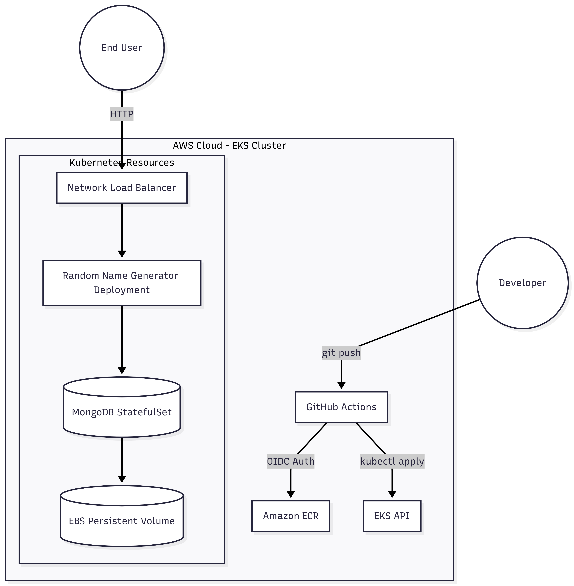

# EKS Cloud-Native CI/CD Pipeline: Random Name Generator

## Overview
This repository demonstrates a complete Cloud-Native deployment of the **Random Name Generator and Saver** application on Amazon EKS Auto Mode. 

The project features:
* A fully automated CI/CD pipeline using **GitHub Actions**.
* Passwordless AWS authentication using **GitHub OIDC**.
* Infrastructure provisioning with **Terraform**.
* Container deployment to **Amazon EKS** using Kubernetes manifests.
* Persistent **MongoDB** storage using StatefulSets and EBS Volumes.

## Cloud Architecture


## Tech Stack
* **Cloud Provider:** AWS (EKS, ECR, IAM, NLB, EBS)
* **Infrastructure as Code:** Terraform
* **Containerization:** Docker
* **Container Orchestration:** Kubernetes
* **CI/CD:** GitHub Actions
* **Authentication:** GitHub OIDC
* **Database:** MongoDB 3.6

## CI/CD Pipeline Workflow
* **Push:** A developer pushes changes to the `main` branch.
* **Authenticate:** GitHub Actions authenticates to AWS using GitHub OIDC.
* **Build:** Docker builds a new container image.
* **Push:** The image is tagged and pushed to Amazon ECR.
* **Deploy:** GitHub Actions deploys the Kubernetes manifests and updates the application.
* **Verify:** The workflow ensures all Kubernetes resources are healthy.

## How to Deploy
Follow these steps to provision the infrastructure and trigger the deployment:

1. **Provision the Infrastructure:**
   ```bash
   cd terraform
   terraform init
   terraform apply
   
   2. **Trigger the Deployment:**
    
   Simply push your code to the `main` branch, and the GitHub Actions pipeline will automatically:
   * Build the Docker image.
   * Push the image to Amazon ECR.
   * Deploy the MongoDB StatefulSet and the application to Amazon EKS.

## Verify the Deployment
After the deployment, update your kubeconfig to interact with the cluster:

```bash
aws eks update-kubeconfig --region us-east-1 --name my-cluster
kubectl get all
```
If everything completed successfully, your application should now be running inside your Amazon EKS cluster.
